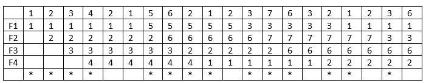
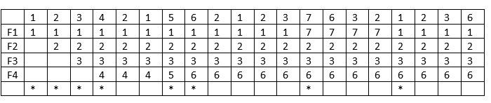
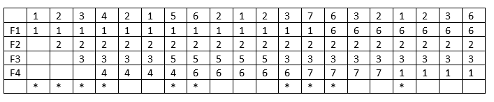
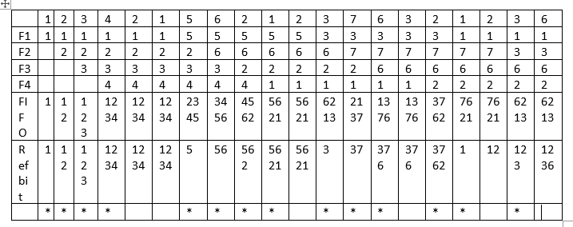

## Bài 01:
Consider the following segment table:
| Segment | Base | Limit |
|---------|------|-------|
| 0       | 219  | 600   |
| 1       | 2300  | 14   |
| 2       | 90  | 100   |
| 3       | 1327  | 580   |
| 4       | 1952  | 96   |

Determine the physical address for each of the following logical addresses:  
a. 0, 701 => invalid  
b. 1, 8   => 2308  
c. 2, 100 => 190  
d. 3, 429 => 1756  
e. 4, 78  => 2030

## Bài 02:
Consider a memory that uses a variable-partition with five free partitions of 500KB, 100Kb, 200KB, 800KB and 300KB in that order. How would the first-fit, best-fit and worst-fit algorithms place processes of 112KB, 212KB, 417KB and 426KB (in order)? In the considered situation, which algorithm is the best choice? justify your answer.

=> 

| Free partitions | First-fit | Best-fit | Worst-fit |
|---------|------|-------|-------|
| 500KB       |  112KB, 212KB | 417KB   | 417KB   |
| 100KB       |   |    |    |
| 200KB       |   | 112KB   |    |
| 800KB       | 417KB  | 426KB   | 112KB, 212KB, 426KB   |
| 300KB       |   | 212KB   |    |
|               |X : 426KB   |  |  |

### The advantages and drawbacks of each algorithm:
| Algorithm | Advantages | Drawbacks |
|---------|------|-------|
| First-fit       | Fast and simple to implement | May leave unusable small holes in memory |
| Best-fit       | Produces the smallest leftover hole | Slow and complex to implement |
| Worst-fit       | Produces the largest leftover hole | Slow and complex to implement |

### The best choice:
=> In the considered situation, the best choice is **Worst-fit** algorithm, because it optimally utilizes free partitions

## Bài 03:
Consider the following page-reference string:
1, 2, 3, 4, 2, 1, 5, 6, 2, 1, 2, 3, 7, 6, 3, 2, 1, 2, 3, 6
Assume demand paging with 4 free frames. For each of these page replacement algorithms (FIFO, optimal, LRU, and Second chance)
a. Show the content of memory after each page reference.
b. Give the number of page faults.
c. Calculate the page fault ratio.
d. Give EAT while supposing that it takes 192ns to handle a page fault occurring (page fault service time ) and 102 ns to access the physical memory.

=>
### FIFO

- Number of page faults: 14
- Page fault ratio: 14 / 20 = 0.7
- EAT: 0.7 * 192 + 0.3 * 102 = 165 ns

### Optimal

- Number of page faults: 8
- Page fault ratio: 8 / 20 = 0.4
- EAT: 0.4 * 192 + 0.6 * 102 = 138 ns

### LRU

- Number of page faults: 10
- Page fault ratio: 10 / 20 = 0.5
- EAT: 0.5 * 192 + 0.5 * 102 = 147 ns

### Second chance

- Number of page faults: 14
- Page fault ratio: 14 / 20 = 0.7
- EAT: 0.7 * 192 + 0.3 * 102 = 165 ns

## Bài 04:
Consider a system that implements paging with a page size of 1KB. Assume a program P loaded into the system. We need eight pages to hold all the virtual (logical) addresses generated by the program P. The main memory is byte-addressable and divided into 32 frames.
a. Calculate the number of bits used for storing a physical address.
b. Calculate the size of the virtual memory space of the program P.
c. Calculate the size of the physical memory space.

=> 
a. 
- A page size of 1KB => 2^10 B  => 10 bits
- 32 frames => 2^5 frames => 5 bits
=> Number of bits used for storing a physical address:  10 + 5 = 15 bits  

b. The size of the virtual memory space of the program P: 8 * 2^10 B = 2^13 B  
c. The size of the physical memory space: 32 * 1KB = 32KB = 2^15 B

## Bài 05:
Consider a system that implements paging with the following characteristics:
- 48 bit logical address
- A page size of 8KB
- A byte-addressable memory of 320MB
a. Give the number of frames in the physical memory.
b. Give the maximum number of pages in logical address space
c. Convert the logical addresses 1892, 15296, 20300 to addresses <p, d>

=> 
a. 320MB = 5 * 2^16 KB  
=> Number of frames:  5 * 2^16 / 8 KB = 5 * 2^13 frames = 40960 frames  
b. A page size of 8KB => 2^3 * 2^10 = 2^13 B  
=> Maximum number of pages: 2^48 / 2^13 = 2^35 pages  
c. 
| Logical address | <p, d> |
|---------|------|
| 1892       | <0, 1892> |
| 15296       | <1, 7104> |
| 20300       | <2, 3916> |

## Bài 06:
Consider a system that implements a two level page table with a 32-bit address: 9-bit used for the top-level page table; 11 bit used for the second level page table. The system has a word addressable memory of 10GB
a. Give the size of a page
b. Give the number of a frames in memory
c. What is the maximum size of process space supported in this system?
d. If loading the process P1 of 2.8GB into this system, may we suffer from the fragmentation problem? Justify your answer.
e. Which type of fragmentation can we have in a paging system?

=>
a. 32 - 9 - 11 = 12 bits => number of offsets/page = 2^12  
=> Size of a page: 2^12 * 4B = 16KB  
b. Number of a frame in memory:  10GB / 16KB = 10 * 2^16 frames  
c. Maximum size of process space: 2^32 * 4B = 16GB  
d. 2.8GB / 16KB = 183500.8 pages => we may suffer from the internal fragmentation problem  
e. Internal fragmentation

## Bài 07:
Consider a system that implements three levels of paging with a TLB. Assume no page fault occurs. It takes 25ns to search the TLB and 132ns to access the physical memory. Calculate the EAT while supposing that TLB hit ratio is 75%.

=> EAT = 0.75 * (25 + 132) + 0.25 * (25 + 132 * 4) 
       = 256 ns

## Bài 08:
Consider a system that implements single levels of paging with a TLB. Assume no page fault occurs. It takes 25ns to search the TLB and 150ns to access the physical memory. Give the hit ratio while supposing that EAT is 225ns.

=> 225 = t * (25 + 150) + (1 - t) * (25 + 150 * 2)
=> t = 66.67%
