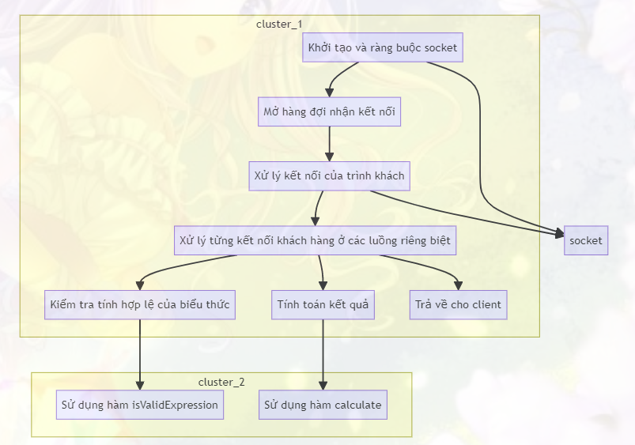
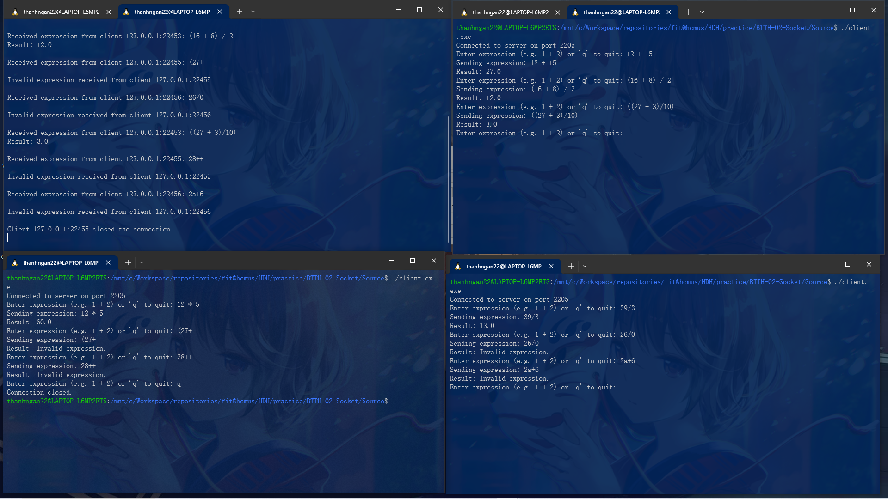

## BÁO CÁO BÀI TẬP THỰC HÀNH 02

### MSSV: 21120505
### Họ và tên: Bùi Thị Thanh Ngân

## Giới thiệu
Chương trình xem xét cách xây dựng một ứng dụng server - n client cho phép tính toán các biểu thức số nguyên. Đây là một ứng dụng mạng đơn giản, trong đó server nhận các biểu thức từ client, tính toán kết quả và gửi lại cho client tương ứng. Đồng thời, ứng dụng này hỗ trợ xử lý đa luồng để có thể đồng thời phục vụ nhiều client.

## Ý tưởng thực hiện

2.1. Khởi tạo và ràng buộc socket
Ở bước đầu tiên, chúng ta tạo một socket mới cho trình chủ bằng cách sử dụng hàm socket(). Socket này sẽ được ràng buộc với một địa chỉ IP và số cổng cụ thể. Trong đoạn mã, chúng ta sử dụng địa chỉ IP "127.0.0.1" để chỉ định localhost và sử dụng một số cổng được xác định trước (PORT). Sau đó, chúng ta ràng buộc tên với socket bằng cách sử dụng hàm bind().

2.2. Mở hàng đợi nhận kết nối
Tiếp theo, chúng ta mở hàng đợi nhận kết nối bằng cách sử dụng hàm listen(). Hàng đợi này cho phép đặt hàng vào hàng đợi tối đa 10 kết nối.

2.3. Xử lý kết nối của trình khách
Sau khi hoàn thành khởi tạo và ràng buộc socket, ứng dụng chạy trong một vòng lặp vô hạn để chờ và xử lý kết nối của các trình khách. Trong vòng lặp này, chúng ta sử dụng hàm accept() để chấp nhận một kết nối từ phía client. Khi một kết nối được chấp nhận, chúng ta tạo một luồng mới (pthread_create()) để xử lý kết nối này.

2.4. Xử lý từng kết nối khách hàng
Mỗi luồng được tạo ra sẽ gọi hàm clientHandler(), được thiết kế để xử lý một kết nối khách hàng cụ thể. Trong hàm clientHandler(), chúng ta đọc biểu thức từ client, loại bỏ đi các kí tự space, kiểm tra tính hợp lệ của biểu thức, tính toán kết quả và gửi lại cho client. Nếu có lỗi đọc hoặc ghi dữ liệu, chúng ta đóng kết nối và kết thúc luồng.

2.4.1 Kiểm tra tính hợp lệ của biểu thức
- Sử dụng hàm isValidExpression để kiểm tra tính hợp lệ của biểu thức.
- Duyệt qua từng ký tự trong biểu thức và kiểm tra các điều kiện sau:
    + Các ký tự chỉ có thể là chữ số, toán tử (+, -, *, /), hoặc dấu ngoặc đơn ().
    + Không có hai toán tử liên tiếp.
    + Không có trường hợp dấu ngoặc đơn trước dấu ngoặc đóng mà không có giữa chúng là biểu thức.
    + Không thể có phép chia cho 0.
    + Số lượng dấu mở và đóng ngoặc phải bằng nhau và không có trường hợp dấu đóng ngoặc xuất hiện trước dấu mở ngoặc.

2.4.2 Tính toán kết quả
Sử dụng hàm calculate để tính giá trị của biểu thức.
Dùng hai stack: một để lưu trữ số (numbers), và một để lưu trữ toán tử (operators).
Duyệt qua từng ký tự trong biểu thức:
- Nếu là số, đẩy vào stack numbers.
- Nếu là dấu ngoặc đơn mở, đẩy vào stack operators.
- Nếu là dấu ngoặc đóng, thực hiện các phép toán với các số và toán tử trong stack cho đến khi gặp dấu ngoặc đơn mở.
- Nếu là toán tử, thực hiện các phép toán với các số và toán tử trong stack có độ ưu tiên lớn hơn hoặc bằng toán tử hiện tại.
- Cuối cùng, tính toán các phần tử còn lại trong stack và trả về kết quả.

2.5. Đóng socket
Cuối cùng, khi ứng dụng kết thúc hoặc xảy ra lỗi, chúng ta đóng socket bằng cách sử dụng hàm close().

## Hình minh họa kết quả chạy chương trình

### Đánh giá mức độ hoàn thành: 100%