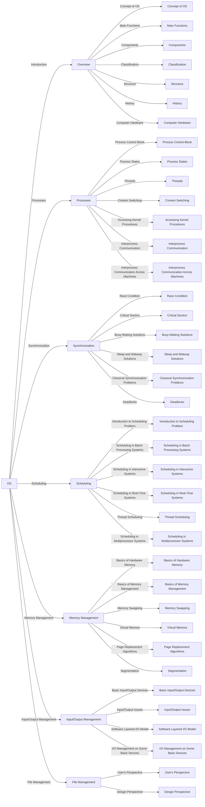

## 🍁 Overview of Operating Systems Course

### Chapter I: Overview
1. **Concept of Operating Systems**
2. **Main Functions of an Operating System**
3. **Components of an Operating System**
   - Process Management
   - Memory Management
   - File System Management
   - Input/Output Management
   - Command Interpreter
   - System Security
   - Network Management

4. **Classification of Operating Systems**
   - Batch Processing System
   - Multiprogramming System
   - Time-Sharing System
   - Parallel System
   - Distributed System
   - Real-Time System

5. **Structure of Operating Systems**
   - Simple Structure
   - Layered Structure
   - Microkernel
   - Modules

6. **History of Operating System Development**

7. **Computer Hardware**
   - Processor (CPU)
   - Memory (RAM)
   - Disk Drive
   - Input/Output Devices
   - Bus Architecture

### Chapter II: Processes
1. **Process Control Block (PCB)**
   - Information in a PCB
   - Storage Location of PCB

2. **Process States**

3. **Threads**
   - Overview
   - Multithreading Model

4. **Context Switching**

5. **Accessing Kernel Procedures**
   - User Space vs. Kernel Space
   - Entry Points to the Kernel
   - System Calls
   - Process Operations
   - Resource Allocation for Processes

6. **Interprocess Communication**
   - Shared Memory
   - Message Passing

7. **Interprocess Communication across Different Machines**
   - Sockets
   - Remote Procedure Call (RPC)

### Chapter III: Synchronization
1. **Race Condition**
2. **Critical Section**
3. **Busy-Waiting Solutions**
   - Software Solutions:
      + Using Flags
      + Turn Variable
      + Peterson's Solution
   - Hardware Solutions:
      + Disabling Interrupts
      + Test and Set Instruction

4. **Sleep and Wakeup Solutions**
   - Semaphores
   - Mutexes
   - Monitors
   - Message Passing
   - Barriers

5. **Classical Synchronization Problems**
   - Dining Philosophers Problem
   - Reader-Writer Problem
   - Barber Shop Problem

6. **Deadlocks**
   - Resource Classification
   - Introduction to Deadlock
      + Conditions Leading to Deadlock
      + Deadlock Modeling
   - Ostrich Algorithm
   - Detection and Recovery of Deadlocks
   - Deadlock Avoidance
   - Deadlock Prevention

### Chapter IV: Scheduling
- **Introduction to Scheduling Problem**
  + Characteristics of Processes
  + Scheduling Times
  + Classification of Scheduling Algorithms
  + Goals of Scheduling Algorithms

1. **Scheduling in Batch Processing Systems**
   - First Come First Served
   - Shortest Job First
   - Shortest Remaining Time Next
   - Two-Level Scheduling

2. **Scheduling in Interactive Systems**
   - Round Robin Scheduling
   - Priority Scheduling
   - Multilevel Priority Scheduling
   - Multilevel Queue Scheduling
   - Shortest Task Next Scheduling
   - Random Scheduling
   - Fair Share Scheduling

3. **Scheduling in Real-Time Systems**
4. **Thread Scheduling**
5. **Scheduling in Multiprocessor Systems**

### Chapter V: Memory Management
1. **Basics of Hardware Memory**
2. **Basics of Memory Management**
   - Single Partition
   - Multiple Fixed Partitions
   - Multiple Variable Partitions
   - Multiprogramming Efficiency
   - Address Relocation and Memory Protection

3. **Memory Swapping**
   - Bitmap-based Memory Management
   - Linked List-based Memory Management

4. **Virtual Memory**
   - Paging
   - Page Tables:
      + Multilevel Page Tables
      + Hashed Page Tables
      + Page Table Entry Structure
   - Translation Lookaside Buffers (TLBs)
   - Inverted Page Tables

5. **Page Replacement Algorithms**
   - Optimal Page Replacement
   - Not Recently Used (NRU)
   - FIFO
   - Second-Chance Algorithm
   - Clock Algorithm
   - Least Recently Used (LRU)
   - Working Set Page Replacement Algorithm
   - WSClock Page Replacement Algorithm

6. **Segmentation**

### Chapter VI: Input/Output Management
1. **Basic Input/Output Devices**
2. **Input/Output Issues**
   - Data Transfer Modes
   - Access Methods
   - Communication Mechanisms:
      + Programmed I/O
      + Interrupt-driven I/O
      + Direct Memory Access (DMA)
   - Data Transfer Modes
   - Other Issues

3. **Software Layered I/O Model**
   - Interrupt Manager
   - Device Drivers
   - Independent Device Component
   - User-Program Interface Component
   - I/O Request Processing

4. **I/O Management on Some Basic Devices**

### Chapter VII: File Management
1. **User's Perspective**
   - File
   - Directory
   - File System
   - Disk Storage Organization

2. **Design Perspective**
   - Disk File System Organization
   - Organization of Some File Systems:
      + FAT
      + NTFS
      + UNIX/Linux File System
